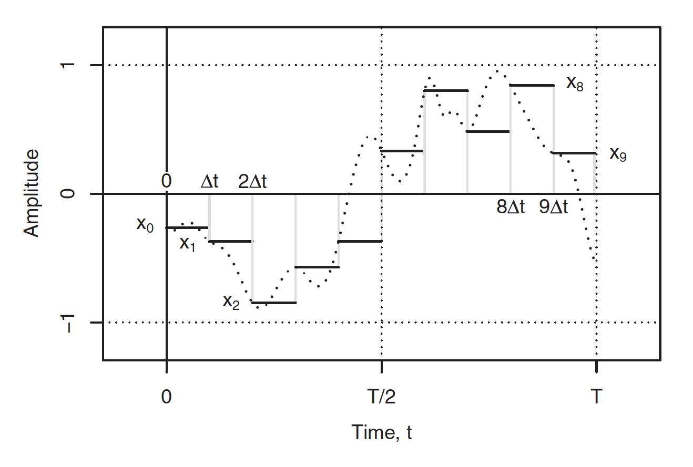
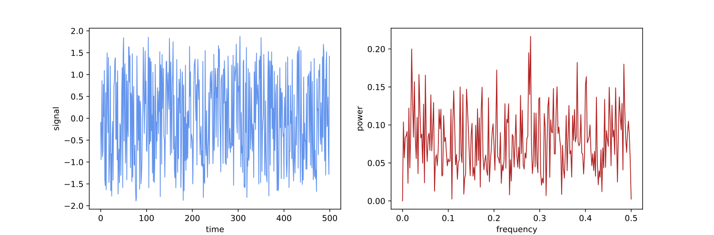

Introduction to Fourier Analysis
================================

In the natural sciences, the procedure to search for periodic signals in
datasets goes by various names, including spectral analysis, harmonic
analysis or Fourier analysis. The latter name refers to Jean-Baptiste
Joseph Fourier (1768 – 1830), the French mathematician who was
especially interested in heat transfer and vibrations (he is also
generally credited for the discovery of the greenhouse effect). Using
his considerable smarts, Fourier realized that any function
:math:`x(t)`, so long as it was single-valued (i.e., one value of
:math:`x(t)` for every value of :math:`t`), could be represented as the
sum of a series of cosine waves taking this form:

.. math::

   \begin{aligned}
   x_k(\theta) = A_k \mathrm{cos}(k\theta - \phi_k) \qquad
   \end{aligned}

where :math:`\theta` is an angular variable for a function
:math:`x_k(\theta)`, with a period of :math:`2\pi` radians. Thus, for a
given frequency :math:`k`, the value :math:`x(\theta)` is determined by
:math:`A_k` (the amplitude of the wave) and the phase angle
:math:`\phi_k` (if :math:`\phi_k` = :math:`\pi/2` radians, or
90\ :math:`^{\circ}`, then :math:`\phi_k` could be dropped and the
cosine function replaced with the sine function). If we rely on the
following trigonometric identity for difference between two angles,
:math:`R` and :math:`S`:

.. math::

   \begin{aligned}
   \mathrm{cos}(R-S) = \mathrm{cos}(S)\mathrm{cos}(R) + \mathrm{sin}(S)\mathrm{sin}(R) \qquad
   \end{aligned}

we can re-write equation 1 as:

.. math::

   \begin{aligned}
   x(\theta) = A_k \mathrm{cos}(\phi_k)\mathrm{cos}(k\theta) +  A_k \mathrm{sin}(\phi_k) \mathrm{sin}(k\theta)\qquad
   \end{aligned}

and because the phase angle is constant for a given frequency, we can
define constants :math:`a_k = A_k \mathrm{cos}(\phi_k)` and
:math:`b_k =  A_k \mathrm{sin}(\phi_k)`, and the general formula for a
cosine wave becomes:

.. math::

   \begin{aligned}
   x_k(\theta) = a_k \mathrm{cos}(k\theta) +  b_k \mathrm{sin}(k\theta) \qquad 
   \end{aligned}

a sum of both a cosine and a sine function. Returning to Fourier and his
realization, we can now write a formula for the *Fourier series*:

.. math::

   \begin{aligned}
   x(\theta) &= \frac{a_0}{2} + \sum_{k=1}^{\infty} a_k \mathrm{cos}(k\theta) + \sum_{k=1}^{\infty} b_k \mathrm{sin}(k\theta) \qquad \\
   \end{aligned}

where we have simplified for the case when k = 0. This series means that
any :math:`x(t)` could be expressed this way, where :math:`x(t)` =
:math:`x(\theta)`. At this point, it is helpful to express
:math:`\theta` as a function of :math:`t`, our original independent
variable, and :math:`T`, the duration of :math:`x(t)`, which is set to
the period of the sinusoid, :math:`2\pi`. Hence, the first non-zero
frequency in our Fourier series (also called the *fundamental* or *first
harmonic* frequency) is :math:`f_1` = :math:`1/T`. All the other
non-zero-frequencies in a Fourier series are harmonics (integer
multiples) of this fundamental frequency, i.e. the second harmonic is
:math:`f_2` = :math:`f_1` + :math:`\Delta`\ f = 2\ :math:`f_1`, third
harmonic is :math:`f_3` = :math:`f_2` + :math:`\Delta`\ f =
3\ :math:`f_1`. Thus, the :math:`k^{th}` frequency in our summation is
:math:`f_k` = :math:`f_{k-1}` + :math:`\Delta`\ f = k\ :math:`f_1`. This
enables us to write the general form for the Fourier series of a time
function :math:`x(t)` of period :math:`T`:

.. math::

   \begin{aligned}
   x(t) &= \frac{a_0}{2} + \sum_{k=1}^{\infty} a_k \mathrm{cos}(\frac{2\pi k}{T}t) + \sum_{k=1}^{\infty} b_k \mathrm{sin}(\frac{2\pi k}{T}t) \\
   x(t) &= \frac{a_0}{2} + \sum_{k=1}^{\infty} a_k \mathrm{cos}(2\pi f_k t) + \sum_{k=1}^{\infty} b_k \mathrm{sin}(2\pi f_k t) \qquad 
   \end{aligned}

If we next rely on Euler’s formulas:

.. math::

   \begin{aligned}
   e^{i\theta} &= \mathrm{cos}(\theta) + i \mathrm{sin}(\theta) \\
   e^{-i\theta} &= \mathrm{cos}(\theta) - i \mathrm{sin}(\theta) \qquad 
   \end{aligned}

where :math:`e` is Euler’s number (:math:`e = 2.718281828459 ....`) and
:math:`i` is the imaginary number :math:`i = \sqrt{-1}`. If one does
enough algebra and trigonometry, one can rewrite Equation 8 as a
*complex Fourier series*:

.. math::

   \begin{aligned}
   x(t) =  \sum_{k=-\infty}^{\infty} c_k e^{2\pi i f_k t} \qquad 
   \end{aligned}

The complex coefficients :math:`c_k` tell you the required *amplitude*
of the cosine and sine waves for each frequency :math:`f_k` needed to
reproduce :math:`x(t)`. They relate directly to the real coefficients
:math:`a_k` and :math:`b_k` according to the following formulas:

.. math::

   \begin{aligned}
   c_k &= \frac{1}{2}(a_k - i b_k)\\
   c_k &= \frac{1}{T} \int_{0}^{T}x(t) (\mathrm{cos} (2 \pi f_k t) - i \mathrm{sin} (2 \pi f_k t)) dt\\
   c_k &= \frac{1}{T} \int_{0}^{T}x(t) e^{-2\pi i f_k t} dt
   \end{aligned}

   a discrete approximation of a continuous function

Discrete Fourier Transform
==========================

| Of course, while mathematicians can deal with functions or time series
  that stretch to infinity, scientists are always dealing with finite
  numbers (Fig. `1 <#fig:discrete>`__). Measurements taken from a
  stratigraphic section, for example, have a beginning and an end
  (covering some period :math:`T`). The dataset will consist of a series
  of values (numbered :math:`n_0`, :math:`n_1`, :math:`n_2`, etc.),
  making up some total number of samples (:math:`N`). Each sample is
  separated by a *sampling interval* (:math:`dt`, assumed here to be
  equal - *this is very important!*). Any resulting time series or
  stratigraphic series (:math:`x_n`) is always going to be a discrete
  approximation of some continuous function (:math:`x(t)`, representing,
  for example, changing sea level with time.
| Thus, we need an approach for describing the sinusoids needed to
  describe a *discretized* time series, :math:`x_n`
  (Fig. `1 <#fig:discrete>`__). In other words, we need a discrete
  version of equation of Equation 14, and this equation takes this form:

.. math::

   \begin{aligned}
   X_k &= \frac{1}{N} \sum_{n=0}^{N-1}x_n e^{-2\pi i \frac{kn}{N}} \qquad 
   \end{aligned}

where :math:`X_k` is being used in place of :math:`c_k` (but is
otherwise the same as :math:`c_k`). Equation 15 is the basic forward
discrete Fourier transform. The index :math:`k` (frequency) also ranges
between :math:`0\leq k \leq N-1`, like :math:`n` (time). Thus, equation
15 is really a system of linear equations:

.. math::

   \begin{aligned}
   \mathbf{\underline{X}} = \begin{pmatrix} X_0 \\
                     X_1\\ 
                     .\\
                     .\\
                     .\\
                     X_k\\
                     .\\
                     .\\
                     .\\
                     X_{N-1}\\
          \end{pmatrix}
         ~\mathrm{and}~
         \mathbf{\underline{x}} = \begin{pmatrix} x_0 \\
                     x_1\\ 
                     .\\
                     .\\
                     .\\
                     x_n\\
                     .\\
                     .\\
                     .\\
                     x_{N-1}\\
          \end{pmatrix} \qquad 
   \end{aligned}

with Equation 15 becoming:

.. math:: \mathbf{\underline{X}} = \mathbf{F}\mathbf{\underline{x}}

and performing a *fast Fourier transform* solves it through matrix
algebra, the lowest frequency resolved is :math:`1/T`, where :math:`T`
is the total time represented by the time series (also equal to
:math:`N \cdot dt`). If :math:`N` (the number of data points) is even,
the highest resolved is frequency 1/(2\ :math:`dt`), where :math:`dt` is
the sampling interval. In between these two end-points, each resolved
frequency is separated by :math:`1/T`. With these FFT coefficients
(:math:`X_k`), which again tell you the *amplitude* of each cosine and
sine wave for each frequency :math:`k`, one can always exactly recreate
the original time series :math:`x_n`.

   A time series :math:`x_n` made of white noise (left), and the fast
   Fourier transform (:math:`X_k`) on the right. The y-axis of the FFT
   indicates the relative contribution of each sinusoid frequency in
   explaining the total signal, and can be used to exactly reproduce the
   original blue curve.

When doing Fourier analysis with the aim of identifying periodic
signals, it is important to remember this fact: *any time series can be
described as a summation of periodic signals*, including pure white
noise (Fig. `2 <#fig:noise>`__). If you have 100 data points that you
think records sea level change over the last 100 years, and you discover
that it can be perfectly described by 50 sinusoids, you have not
discovered that sea level has 50 nested cycles - you have simply
demonstrated the Fourier relationship (Equation 1). Instead, what we are
looking for with such an analysis is: does a periodic signal explain a
significant amount of the variation within a time series? If a
significant peak is located, does this periodic signal *make sense* as a
potential driver of Earth system change (i.e., is it a known or expected
frequency of change in climate, etc.)? Keep these concepts in mind as
you explore two different datasets below!
